# Modelagem Logica Inicial do Banco de Dados

## Projeto

Aplicativo interno de diagnostico tecnico com IA para manutencao de desktops, notebooks, televisores e celulares.

Escopo desta etapa:

- somente modelagem logica do banco;
- sem SQL;
- sem telas;
- sem implementacao da IA;
- preparado para Supabase/PostgreSQL, Supabase Storage e `pgvector`.

Fora de escopo nesta etapa:

- clientes;
- ordem de servico;
- financeiro;
- estoque;
- automacoes de IA;
- permissao fina por tela.

## Objetivos da modelagem

O banco deve permitir:

- registrar diagnosticos tecnicos completos;
- guardar historico cronologico de testes, medicoes e decisoes;
- armazenar conhecimento permanente sobre equipamentos, placas e componentes;
- suportar busca semantica futura com embeddings;
- sustentar um fluxo em que a IA consulte primeiro a base interna antes de responder;
- diferenciar claramente hipotese, evidência, causa confirmada e solucao aplicada;
- manter trilha de auditoria das alteracoes.

## Decisao de arquitetura

A modelagem foi dividida em quatro dominios principais:

1. Catalogo tecnico mestre
2. Operacao de diagnostico
3. Conhecimento consolidado
4. Infraestrutura de busca e auditoria

Essa separacao reduz acoplamento e ajuda a evoluir o sistema por etapas.

## Convencoes recomendadas

- Todas as entidades devem usar identificador unico (`uuid` no futuro).
- Todas as entidades de negocio devem ter `created_at`, `updated_at` e, quando fizer sentido, `created_by`, `updated_by`.
- Campos de texto livre relevantes para busca semantica devem prever versao consolidada para embeddings.
- Exclusao fisica deve ser evitada nas entidades operacionais mais importantes; preferir inativacao logica quando aplicavel.
- Arquivos ficam no Supabase Storage; o banco guarda somente metadados e referencias.

---

## 1. Dominio de Usuarios e Tecnicos

### 1.1 `users`

Representa usuarios autenticados do sistema.

Campos principais:

- `id`
- `auth_user_id`
- `full_name`
- `email`
- `status`
- `last_login_at`
- `created_at`
- `updated_at`

Observacoes:

- `auth_user_id` deve se alinhar ao Supabase Auth.
- `status` deve permitir valores como `active`, `inactive`, `blocked`.

### 1.2 `technician_profiles`

Extensao operacional do usuario para contexto tecnico.

Campos principais:

- `id`
- `user_id`
- `display_name`
- `specialties_summary`
- `notes`
- `is_reviewer`
- `created_at`
- `updated_at`

Observacoes:

- separa autenticacao de perfil tecnico;
- permite que nem todo usuario seja necessariamente tecnico no futuro.

Relacionamentos:

- `users` 1:1 `technician_profiles`

---

## 2. Dominio de Catalogo Tecnico Mestre

Esse dominio guarda conhecimento estrutural relativamente estavel.

### 2.1 `equipment_categories`

Categorias principais de equipamento.

Campos principais:

- `id`
- `name`
- `slug`
- `description`
- `is_active`

Exemplos:

- desktop
- notebook
- television
- smartphone

### 2.2 `manufacturers`

Fabricantes ou marcas.

Campos principais:

- `id`
- `name`
- `normalized_name`
- `country`
- `notes`
- `is_active`

### 2.3 `equipment_models`

Modelo comercial do equipamento.

Campos principais:

- `id`
- `manufacturer_id`
- `equipment_category_id`
- `model_name`
- `normalized_model_name`
- `family_name`
- `revision_label`
- `release_notes`
- `is_active`

Observacoes:

- `normalized_model_name` ajuda a prevenir duplicidade;
- `family_name` ajuda a agrupar familias tecnicas.

Relacionamentos:

- `manufacturers` 1:N `equipment_models`
- `equipment_categories` 1:N `equipment_models`

### 2.4 `board_types`

Tipifica placas para padronizar o catalogo.

Campos principais:

- `id`
- `name`
- `slug`
- `description`

Exemplos:

- mainboard
- power_supply
- tcon
- logic_board
- daughterboard

### 2.5 `boards`

Cadastro de placas tecnicas associadas a modelos ou usadas em varias familias.

Campos principais:

- `id`
- `board_type_id`
- `manufacturer_id`
- `board_code`
- `board_revision`
- `description`
- `notes`
- `is_active`

Observacoes:

- uma placa pode existir antes de ser vinculada a um modelo;
- `board_code` deve ser unico dentro de um criterio de normalizacao.

### 2.6 `model_boards`

Tabela de associacao entre modelos e placas.

Campos principais:

- `id`
- `equipment_model_id`
- `board_id`
- `role_label`
- `is_primary`
- `notes`

Exemplos de `role_label`:

- placa principal
- fonte
- t-con
- placa de carga

Relacionamentos:

- `equipment_models` N:N `boards` via `model_boards`

### 2.7 `components`

Cadastro mestre de componentes eletricos.

Campos principais:

- `id`
- `component_ref`
- `component_type`
- `manufacturer_part_number`
- `generic_part_number`
- `description`
- `package_type`
- `datasheet_summary`
- `notes`
- `is_active`

Exemplos:

- `IC3301`
- `U3201`
- `Q501`

Observacoes:

- `component_ref` sozinho nao deve ser tratado como globalmente unico fora do contexto da placa;
- por isso o cadastro mestre representa o componente como item tecnico reutilizavel e nao sua posicao em placa.

### 2.8 `board_components`

Instancia o componente dentro de uma placa especifica.

Campos principais:

- `id`
- `board_id`
- `component_id`
- `reference_designator`
- `circuit_function`
- `expected_behavior`
- `location_notes`
- `is_critical`
- `notes`

Observacoes:

- `reference_designator` deve ser unico por placa;
- e aqui que `IC3301` ganha contexto real dentro de uma `board`.

Relacionamentos:

- `boards` 1:N `board_components`
- `components` 1:N `board_components`

### 2.9 `technical_documents`

Metadados de documentos tecnicos.

Campos principais:

- `id`
- `manufacturer_id`
- `equipment_model_id`
- `board_id`
- `component_id`
- `document_type`
- `title`
- `language`
- `version_label`
- `storage_path`
- `mime_type`
- `file_size_bytes`
- `checksum`
- `source_label`
- `is_indexed`
- `notes`
- `created_at`

Tipos esperados:

- schematic
- service_manual
- boardview
- datasheet
- firmware
- bios
- technical_note
- voltage_map

Observacoes:

- ao menos um dos vinculos de contexto deve existir: fabricante, modelo, placa ou componente;
- `storage_path` aponta para o arquivo no Supabase Storage.

---

## 3. Dominio Operacional de Diagnostico

Esse dominio representa o trabalho diario da bancada.

### 3.1 `diagnostics`

Entidade principal de cada caso em andamento ou concluido.

Campos principais:

- `id`
- `equipment_category_id`
- `manufacturer_id`
- `equipment_model_id`
- `primary_board_id`
- `opened_by_user_id`
- `assigned_technician_id`
- `status`
- `priority`
- `equipment_serial_number`
- `equipment_label`
- `initial_problem_report`
- `current_summary`
- `physical_condition_notes`
- `intake_context`
- `started_at`
- `completed_at`
- `created_at`
- `updated_at`

Observacoes:

- substitui a ideia de ordem de servico, mas sem dados comerciais;
- `equipment_label` pode ser um apelido interno para identificar fisicamente o aparelho.

Valores sugeridos para `status`:

- draft
- active
- waiting_input
- resolved
- unresolved
- archived

### 3.2 `diagnostic_boards`

Placas efetivamente presentes ou investigadas em um diagnostico.

Campos principais:

- `id`
- `diagnostic_id`
- `board_id`
- `role_label`
- `is_primary`
- `condition_notes`
- `notes`

Observacoes:

- permite registrar diferencas entre o catalogo mestre e o aparelho real;
- necessario porque nem sempre o equipamento bate exatamente com o cadastro previsto.

### 3.3 `symptoms`

Catalogo padronizado de sintomas.

Campos principais:

- `id`
- `equipment_category_id`
- `name`
- `slug`
- `description`
- `symptom_group`
- `is_active`

Exemplos:

- nao liga
- reinicia
- sem imagem
- liga com som sem imagem
- nao carrega

### 3.4 `diagnostic_symptoms`

Relaciona sintomas ao diagnostico.

Campos principais:

- `id`
- `diagnostic_id`
- `symptom_id`
- `severity`
- `is_primary`
- `source_type`
- `notes`
- `captured_at`

Observacoes:

- `source_type` pode indicar origem como tecnico, IA ou extraido de texto.

### 3.5 `tests`

Catalogo padronizado de tipos de teste.

Campos principais:

- `id`
- `name`
- `slug`
- `test_group`
- `description`
- `default_unit`
- `is_active`

Exemplos:

- medicao de tensao
- teste de continuidade
- regravacao de bios
- substituicao cruzada
- teste com fonte assimetrica

### 3.6 `diagnostic_test_runs`

Registro cronologico dos testes executados.

Campos principais:

- `id`
- `diagnostic_id`
- `test_id`
- `diagnostic_board_id`
- `board_component_id`
- `performed_by_user_id`
- `step_order`
- `requested_by_ai_response_id`
- `result_status`
- `procedure_notes`
- `expected_result`
- `actual_result`
- `conclusion`
- `performed_at`
- `created_at`

Valores sugeridos para `result_status`:

- pending
- passed
- failed
- inconclusive
- not_applicable

Observacoes:

- `step_order` preserva o fluxo de investigacao;
- o vinculo com `requested_by_ai_response_id` permite saber qual resposta da IA originou o teste.

### 3.7 `measurements`

Medicoes detalhadas vinculadas a um teste ou registradas isoladamente.

Campos principais:

- `id`
- `diagnostic_id`
- `diagnostic_test_run_id`
- `diagnostic_board_id`
- `board_component_id`
- `measurement_type`
- `point_label`
- `unit`
- `expected_value_text`
- `measured_value_numeric`
- `measured_value_text`
- `tolerance_text`
- `measurement_context`
- `is_out_of_range`
- `measured_at`
- `measured_by_user_id`

Observacoes:

- usar campo numerico e campo texto evita perda de informacao em leituras complexas;
- `measurement_type` pode incluir tensao, resistencia, corrente, temperatura, consumo, frequencia.

### 3.8 `hypotheses`

Hipoteses levantadas durante o diagnostico.

Campos principais:

- `id`
- `diagnostic_id`
- `diagnostic_board_id`
- `board_component_id`
- `title`
- `description`
- `status`
- `confidence_score`
- `evidence_summary`
- `contradictions_summary`
- `created_by_type`
- `created_by_user_id`
- `superseded_by_hypothesis_id`
- `created_at`
- `updated_at`

Valores sugeridos para `status`:

- open
- strengthened
- weakened
- discarded
- confirmed

Observacoes:

- importante separar hipotese de causa confirmada;
- `confidence_score` deve ser interpretado como apoio relativo, nunca certeza tecnica.

### 3.9 `ai_responses`

Registra cada resposta gerada pela IA dentro de um diagnostico.

Campos principais:

- `id`
- `diagnostic_id`
- `prompt_context_version`
- `response_role`
- `reasoning_summary`
- `recommended_next_step`
- `confidence_score`
- `raw_response_text`
- `structured_response_json`
- `model_name`
- `tokens_input`
- `tokens_output`
- `created_at`

Observacoes:

- `structured_response_json` deve guardar partes importantes da resposta para consumo futuro;
- `reasoning_summary` deve ser curto e auditavel.

### 3.10 `attachments`

Metadados de anexos operacionais.

Campos principais:

- `id`
- `diagnostic_id`
- `diagnostic_test_run_id`
- `measurement_id`
- `technical_document_id`
- `attachment_type`
- `title`
- `description`
- `storage_path`
- `mime_type`
- `file_size_bytes`
- `checksum`
- `captured_at`
- `uploaded_by_user_id`

Tipos esperados:

- photo
- video
- screenshot
- waveform
- report

Observacoes:

- um anexo pode pertencer a varios contextos, mas sempre deve ter um contexto principal claro.

### 3.11 `tags`

Tags livres ou controladas.

Campos principais:

- `id`
- `name`
- `slug`
- `tag_group`
- `color_hint`
- `description`
- `is_active`

### 3.12 `tag_links`

Associacao generica de tags.

Campos principais:

- `id`
- `tag_id`
- `target_type`
- `target_id`
- `created_by_user_id`
- `created_at`

Observacoes:

- `target_type` pode referenciar entidades como diagnostico, modelo, placa, componente, documento, caso resolvido;
- como nao ha SQL nesta etapa, a validacao dessa associacao fica definida como regra de aplicacao e depois por constraints apropriadas.

---

## 4. Dominio de Conhecimento Consolidado

Esse dominio representa o que foi aprendido ao final do processo.

### 4.1 `resolved_cases`

Consolidado de um diagnostico encerrado com ou sem solucao.

Campos principais:

- `id`
- `diagnostic_id`
- `case_status`
- `resolution_summary`
- `final_failure_mode`
- `repair_outcome`
- `time_to_resolution_minutes`
- `reviewed_by_user_id`
- `reviewed_at`
- `knowledge_promoted_at`
- `created_at`

Valores sugeridos para `case_status`:

- confirmed
- probable
- unresolved

Observacoes:

- um diagnostico pode gerar no maximo um `resolved_case`;
- so casos revisados devem ser promovidos como conhecimento forte.

### 4.2 `confirmed_causes`

Causa confirmada ou provavel vinculada ao caso resolvido.

Campos principais:

- `id`
- `resolved_case_id`
- `diagnostic_board_id`
- `board_component_id`
- `cause_type`
- `title`
- `technical_explanation`
- `evidence_summary`
- `confidence_score`
- `is_primary`
- `created_at`

Exemplos de `cause_type`:

- component_failure
- short_circuit
- bad_solder
- firmware_corruption
- line_missing
- liquid_damage

### 4.3 `applied_solutions`

Solucoes aplicadas durante ou ao final do caso.

Campos principais:

- `id`
- `resolved_case_id`
- `confirmed_cause_id`
- `solution_type`
- `title`
- `procedure_description`
- `result_notes`
- `was_effective`
- `performed_by_user_id`
- `performed_at`
- `created_at`

Exemplos de `solution_type`:

- component_replacement
- rework
- firmware_flash
- jumper
- cleaning
- reballing
- configuration_change

Observacoes:

- um caso pode ter varias solucoes;
- nem toda solucao aplicada necessariamente foi a solucao efetiva final.

### 4.4 `case_related_documents`

Vincula documentos tecnicos relevantes a um caso resolvido.

Campos principais:

- `id`
- `resolved_case_id`
- `technical_document_id`
- `usage_notes`

---

## 5. Dominio de Busca Semantica e Embeddings

Esse dominio prepara o sistema para RAG e busca inteligente.

### 5.1 `embedding_sources`

Define quais registros geram embeddings.

Campos principais:

- `id`
- `source_type`
- `source_id`
- `content_role`
- `content_text`
- `content_hash`
- `language`
- `is_active`
- `last_generated_at`

Exemplos de `source_type`:

- diagnostic
- ai_response
- technical_document
- resolved_case
- component
- model

Exemplos de `content_role`:

- summary
- diagnosis_context
- solution_summary
- document_chunk

### 5.2 `embeddings`

Armazena vetor e metadados de indexacao.

Campos principais:

- `id`
- `embedding_source_id`
- `model_name`
- `vector_dimensions`
- `vector_value`
- `created_at`

Observacoes:

- `vector_value` sera do tipo `vector` no futuro com `pgvector`;
- pode haver regeneracao de embeddings ao trocar modelo.

### 5.3 `document_chunks`

Fragmentos textuais extraidos de documentos tecnicos para indexacao.

Campos principais:

- `id`
- `technical_document_id`
- `chunk_order`
- `page_reference`
- `section_label`
- `chunk_text`
- `token_estimate`
- `created_at`

Observacoes:

- cada `document_chunk` tende a gerar um `embedding_source`.

---

## 6. Dominio de Historico e Auditoria

### 6.1 `change_history`

Historico de alteracoes relevantes.

Campos principais:

- `id`
- `entity_type`
- `entity_id`
- `change_type`
- `field_name`
- `old_value_text`
- `new_value_text`
- `change_reason`
- `changed_by_user_id`
- `changed_at`

Tipos sugeridos de `change_type`:

- create
- update
- delete
- status_change
- merge
- restore

Observacoes:

- deve focar em entidades criticas como diagnosticos, testes, medicoes, hipoteses, casos resolvidos e documentos.

### 6.2 `entity_reviews`

Registro de revisoes tecnicas ou validacoes humanas.

Campos principais:

- `id`
- `entity_type`
- `entity_id`
- `review_status`
- `review_notes`
- `reviewed_by_user_id`
- `reviewed_at`

Observacoes:

- importante para separar conhecimento bruto de conhecimento validado.

---

## Relacionamentos Principais

### Catalogo

- `equipment_categories` 1:N `equipment_models`
- `manufacturers` 1:N `equipment_models`
- `manufacturers` 1:N `boards`
- `board_types` 1:N `boards`
- `equipment_models` N:N `boards` via `model_boards`
- `boards` 1:N `board_components`
- `components` 1:N `board_components`
- `technical_documents` pode se relacionar opcionalmente com `manufacturers`, `equipment_models`, `boards` e `components`

### Operacao

- `diagnostics` N:1 `equipment_categories`
- `diagnostics` N:1 `manufacturers`
- `diagnostics` N:1 `equipment_models`
- `diagnostics` N:1 `boards` como placa principal opcional
- `diagnostics` 1:N `diagnostic_boards`
- `diagnostics` N:N `symptoms` via `diagnostic_symptoms`
- `diagnostics` 1:N `diagnostic_test_runs`
- `diagnostics` 1:N `measurements`
- `diagnostics` 1:N `hypotheses`
- `diagnostics` 1:N `ai_responses`
- `diagnostics` 1:N `attachments`

### Conhecimento consolidado

- `diagnostics` 1:0..1 `resolved_cases`
- `resolved_cases` 1:N `confirmed_causes`
- `resolved_cases` 1:N `applied_solutions`
- `resolved_cases` N:N `technical_documents` via `case_related_documents`

### Busca e auditoria

- `embedding_sources` 1:N `embeddings`
- `technical_documents` 1:N `document_chunks`
- `document_chunks` pode originar `embedding_sources`
- `change_history` e `entity_reviews` referenciam entidades por `entity_type` + `entity_id`

---

## Regras de Integridade

### Regras de catalogo

- Um `equipment_model` deve pertencer a exatamente um fabricante e uma categoria.
- Um `board_component.reference_designator` deve ser unico dentro da mesma placa.
- Um `technical_document` deve possuir pelo menos um contexto tecnico associado.
- Nomes normalizados devem ser usados para detectar duplicidade de fabricantes, modelos e placas.

### Regras operacionais

- Um `diagnostic` deve ter categoria de equipamento e relato inicial.
- Um `diagnostic` pode existir sem modelo exato definido no inicio, mas deve permitir refinamento posterior.
- Um `diagnostic_test_run` deve referenciar um `diagnostic`.
- Uma `measurement` deve referenciar um `diagnostic` e idealmente um teste ou contexto tecnico especifico.
- Uma `hypothesis` nunca substitui formalmente uma `confirmed_cause`.
- Uma `ai_response` nunca deve marcar um caso como resolvido sem validacao humana.

### Regras de conhecimento

- Um `resolved_case` so pode ser promovido se o `diagnostic.status` estiver encerrado.
- `confirmed_causes` devem existir apenas para `resolved_cases`.
- `applied_solutions.was_effective = true` deve ser controlado por validacao humana.
- Casos `probable` e `unresolved` devem ser pesquisaveis, mas ter peso menor em recomendacoes futuras.

### Regras de embeddings

- Nem todo registro precisa gerar embedding.
- Embeddings devem ser gerados apenas para textos consolidados e uteis para busca.
- Mudanca relevante no texto fonte deve invalidar o embedding anterior.

### Regras de auditoria

- Alteracoes em medicoes, hipoteses, respostas da IA e casos resolvidos devem ser auditaveis.
- Ajustes manuais em conhecimento promovido devem exigir revisao humana registrada.

---

## Decisoes Importantes de Modelagem

### 1. Separacao entre catalogo mestre e diagnostico operacional

Essa separacao evita misturar conhecimento estrutural permanente com fatos observados em um aparelho especifico.

### 2. Separacao entre hipotese e causa confirmada

Esse ponto e essencial para o sistema nao tratar sugestoes como verdade tecnica.

### 3. Separacao entre documento e anexo operacional

`technical_documents` representam materiais de referencia.

`attachments` representam evidencias do caso, como fotos, videos e capturas.

### 4. Uso de tabelas de associacao para contexto flexivel

Modelos podem compartilhar placas, placas podem compartilhar componentes e documentos podem ter escopo variavel. Por isso a modelagem evita acoplamento rigido.

### 5. Preparacao explicita para RAG

Embeddings nao ficam espalhados pelas entidades principais. O dominio de `embedding_sources` centraliza a estrategia de indexacao.

### 6. Auditoria como parte do dominio, nao como detalhe

Como o sistema acumulara conhecimento tecnico de alto valor, rastrear alteracoes e revisoes e requisito estrutural.

---

## Fluxo Conceitual do Dado

1. O tecnico cria um `diagnostic`.
2. Vincula categoria, fabricante, modelo e placas conhecidas.
3. Registra `diagnostic_symptoms`, `diagnostic_test_runs`, `measurements` e `attachments`.
4. O sistema ou a IA gera `hypotheses` e `ai_responses`.
5. Ao final, o caso pode ser consolidado em `resolved_cases`.
6. A causa final entra em `confirmed_causes`.
7. O reparo executado entra em `applied_solutions`.
8. Resumos relevantes geram `embedding_sources` e `embeddings`.
9. Toda alteracao importante pode ser registrada em `change_history`.

---

## Pontos para Revisao na Proxima Etapa

Antes de transformar isso em diagrama e depois em SQL, vale revisar:

- se os dominios estao separados da forma esperada;
- se o nivel de detalhe de placas e componentes esta adequado para a bancada;
- se `tags` devem continuar genericas ou ficar segmentadas por entidade;
- se `change_history` deve registrar todos os campos ou apenas eventos relevantes;
- se precisamos incluir desde ja uma entidade para familias de defeito ou arvore de diagnostico.

## Resultado esperado desta etapa

Esta modelagem inicial entrega:

- base logica coerente para o projeto;
- separacao entre memoria estrutural e memoria de diagnosticos;
- espaco para evolucao futura da IA com RAG e embeddings;
- trilha de conhecimento consolidado e auditavel;
- fundacao pronta para a proxima revisao antes de qualquer SQL.

---

## Diagrama Conceitual Inicial

```mermaid
erDiagram
    users ||--o| technician_profiles : has

    equipment_categories ||--o{ equipment_models : classifies
    manufacturers ||--o{ equipment_models : owns
    board_types ||--o{ boards : types
    manufacturers ||--o{ boards : owns
    equipment_models ||--o{ model_boards : links
    boards ||--o{ model_boards : links
    boards ||--o{ board_components : contains
    components ||--o{ board_components : instantiates

    manufacturers ||--o{ technical_documents : scopes
    equipment_models ||--o{ technical_documents : scopes
    boards ||--o{ technical_documents : scopes
    components ||--o{ technical_documents : scopes

    equipment_categories ||--o{ diagnostics : classifies
    manufacturers ||--o{ diagnostics : identifies
    equipment_models ||--o{ diagnostics : identifies
    boards ||--o{ diagnostics : primary_board
    users ||--o{ diagnostics : opens
    technician_profiles ||--o{ diagnostics : assigned

    diagnostics ||--o{ diagnostic_boards : includes
    boards ||--o{ diagnostic_boards : references

    equipment_categories ||--o{ symptoms : groups
    diagnostics ||--o{ diagnostic_symptoms : records
    symptoms ||--o{ diagnostic_symptoms : maps

    diagnostics ||--o{ diagnostic_test_runs : executes
    tests ||--o{ diagnostic_test_runs : standardizes
    diagnostic_boards ||--o{ diagnostic_test_runs : targets
    board_components ||--o{ diagnostic_test_runs : targets
    users ||--o{ diagnostic_test_runs : performs
    ai_responses ||--o{ diagnostic_test_runs : requests

    diagnostics ||--o{ measurements : captures
    diagnostic_test_runs ||--o{ measurements : produces
    diagnostic_boards ||--o{ measurements : locates
    board_components ||--o{ measurements : locates
    users ||--o{ measurements : measures

    diagnostics ||--o{ hypotheses : raises
    diagnostic_boards ||--o{ hypotheses : scopes
    board_components ||--o{ hypotheses : scopes
    users ||--o{ hypotheses : authors

    diagnostics ||--o{ ai_responses : logs

    diagnostics ||--o{ attachments : stores
    diagnostic_test_runs ||--o{ attachments : evidences
    measurements ||--o{ attachments : evidences
    technical_documents ||--o{ attachments : references
    users ||--o{ attachments : uploads

    tags ||--o{ tag_links : connects

    diagnostics ||--o| resolved_cases : consolidates
    resolved_cases ||--o{ confirmed_causes : explains
    resolved_cases ||--o{ applied_solutions : applies
    confirmed_causes ||--o{ applied_solutions : addresses
    resolved_cases ||--o{ case_related_documents : references
    technical_documents ||--o{ case_related_documents : supports
    users ||--o{ resolved_cases : reviews
    users ||--o{ applied_solutions : performs

    technical_documents ||--o{ document_chunks : splits
    embedding_sources ||--o{ embeddings : generates

    users ||--o{ change_history : changes
    users ||--o{ entity_reviews : reviews
```

## Leitura do diagrama

- `equipment_models`, `boards` e `components` formam o catalogo tecnico mestre.
- `diagnostics` e suas tabelas filhas formam o historico operacional da bancada.
- `resolved_cases`, `confirmed_causes` e `applied_solutions` representam conhecimento validado.
- `technical_documents`, `document_chunks`, `embedding_sources` e `embeddings` preparam o sistema para busca semantica e RAG.
- `change_history` e `entity_reviews` garantem rastreabilidade e revisao humana.

---

## Dicionario Estrutural das Entidades

Esta secao detalha o papel de cada entidade, seus campos mais criticos e o nivel de obrigatoriedade esperado para a futura implementacao.

Legenda:

- obrigatorio: deve existir na criacao do registro;
- condicional: depende do contexto do registro;
- opcional: pode ser preenchido depois.

### Usuarios e tecnicos

#### `users`

Finalidade:

- representar a identidade autenticada no sistema.

Campos criticos:

- `id`: obrigatorio
- `auth_user_id`: obrigatorio
- `full_name`: obrigatorio
- `email`: obrigatorio
- `status`: obrigatorio
- `last_login_at`: opcional

#### `technician_profiles`

Finalidade:

- representar o perfil operacional do tecnico ou revisor.

Campos criticos:

- `id`: obrigatorio
- `user_id`: obrigatorio
- `display_name`: obrigatorio
- `specialties_summary`: opcional
- `is_reviewer`: obrigatorio

### Catalogo tecnico mestre

#### `equipment_categories`

Finalidade:

- classificar o tipo macro do equipamento.

Campos criticos:

- `id`: obrigatorio
- `name`: obrigatorio
- `slug`: obrigatorio
- `description`: opcional

#### `manufacturers`

Finalidade:

- catalogar fabricantes e marcas.

Campos criticos:

- `id`: obrigatorio
- `name`: obrigatorio
- `normalized_name`: obrigatorio
- `country`: opcional

#### `equipment_models`

Finalidade:

- representar o modelo comercial do equipamento.

Campos criticos:

- `id`: obrigatorio
- `manufacturer_id`: obrigatorio
- `equipment_category_id`: obrigatorio
- `model_name`: obrigatorio
- `normalized_model_name`: obrigatorio
- `family_name`: opcional
- `revision_label`: opcional

#### `board_types`

Finalidade:

- padronizar o tipo funcional da placa.

Campos criticos:

- `id`: obrigatorio
- `name`: obrigatorio
- `slug`: obrigatorio

#### `boards`

Finalidade:

- representar placas tecnicas reutilizaveis entre modelos.

Campos criticos:

- `id`: obrigatorio
- `board_type_id`: obrigatorio
- `manufacturer_id`: condicional
- `board_code`: obrigatorio
- `board_revision`: opcional
- `description`: opcional

Observacao:

- `manufacturer_id` pode ser condicional porque algumas placas podem ser registradas primeiro por codigo tecnico, antes de confirmar a marca.

#### `model_boards`

Finalidade:

- associar modelos a placas conhecidas.

Campos criticos:

- `id`: obrigatorio
- `equipment_model_id`: obrigatorio
- `board_id`: obrigatorio
- `role_label`: obrigatorio
- `is_primary`: obrigatorio

#### `components`

Finalidade:

- representar o componente como item tecnico reaproveitavel.

Campos criticos:

- `id`: obrigatorio
- `component_ref`: obrigatorio
- `component_type`: obrigatorio
- `manufacturer_part_number`: condicional
- `generic_part_number`: opcional
- `description`: opcional

#### `board_components`

Finalidade:

- contextualizar o componente dentro de uma placa especifica.

Campos criticos:

- `id`: obrigatorio
- `board_id`: obrigatorio
- `component_id`: obrigatorio
- `reference_designator`: obrigatorio
- `circuit_function`: opcional
- `expected_behavior`: opcional
- `is_critical`: obrigatorio

#### `technical_documents`

Finalidade:

- registrar manuais, esquemas, datasheets e outros arquivos de referencia.

Campos criticos:

- `id`: obrigatorio
- `document_type`: obrigatorio
- `title`: obrigatorio
- `storage_path`: obrigatorio
- `mime_type`: obrigatorio
- `checksum`: recomendavel
- `manufacturer_id`: condicional
- `equipment_model_id`: condicional
- `board_id`: condicional
- `component_id`: condicional

Regra:

- pelo menos um campo de contexto tecnico deve estar preenchido.

### Operacao de diagnostico

#### `diagnostics`

Finalidade:

- representar o caso tecnico em analise.

Campos criticos:

- `id`: obrigatorio
- `equipment_category_id`: obrigatorio
- `manufacturer_id`: condicional
- `equipment_model_id`: condicional
- `primary_board_id`: opcional
- `opened_by_user_id`: obrigatorio
- `assigned_technician_id`: condicional
- `status`: obrigatorio
- `initial_problem_report`: obrigatorio
- `started_at`: obrigatorio
- `completed_at`: opcional

Observacao:

- fabricante e modelo podem ser refinados ao longo do processo.

#### `diagnostic_boards`

Finalidade:

- registrar placas realmente encontradas ou investigadas no caso.

Campos criticos:

- `id`: obrigatorio
- `diagnostic_id`: obrigatorio
- `board_id`: condicional
- `role_label`: obrigatorio
- `is_primary`: obrigatorio
- `condition_notes`: opcional

Observacao:

- `board_id` pode ser condicional quando a placa ainda nao foi identificada no catalogo mestre.

#### `symptoms`

Finalidade:

- padronizar sintomas recorrentes.

Campos criticos:

- `id`: obrigatorio
- `equipment_category_id`: obrigatorio
- `name`: obrigatorio
- `slug`: obrigatorio
- `symptom_group`: opcional

#### `diagnostic_symptoms`

Finalidade:

- ligar sintomas ao caso com contexto de gravidade e origem.

Campos criticos:

- `id`: obrigatorio
- `diagnostic_id`: obrigatorio
- `symptom_id`: obrigatorio
- `is_primary`: obrigatorio
- `source_type`: obrigatorio
- `captured_at`: obrigatorio

#### `tests`

Finalidade:

- padronizar tipos de procedimento tecnico.

Campos criticos:

- `id`: obrigatorio
- `name`: obrigatorio
- `slug`: obrigatorio
- `test_group`: opcional

#### `diagnostic_test_runs`

Finalidade:

- registrar a execucao concreta de um teste dentro do diagnostico.

Campos criticos:

- `id`: obrigatorio
- `diagnostic_id`: obrigatorio
- `test_id`: obrigatorio
- `performed_by_user_id`: obrigatorio
- `step_order`: obrigatorio
- `result_status`: obrigatorio
- `performed_at`: obrigatorio
- `diagnostic_board_id`: opcional
- `board_component_id`: opcional
- `requested_by_ai_response_id`: opcional

#### `measurements`

Finalidade:

- registrar leituras tecnicas detalhadas.

Campos criticos:

- `id`: obrigatorio
- `diagnostic_id`: obrigatorio
- `measurement_type`: obrigatorio
- `unit`: condicional
- `measured_at`: obrigatorio
- `measured_by_user_id`: obrigatorio
- `diagnostic_test_run_id`: condicional
- `diagnostic_board_id`: opcional
- `board_component_id`: opcional

#### `hypotheses`

Finalidade:

- representar suspeitas ou linhas de investigacao.

Campos criticos:

- `id`: obrigatorio
- `diagnostic_id`: obrigatorio
- `title`: obrigatorio
- `status`: obrigatorio
- `confidence_score`: opcional
- `created_by_type`: obrigatorio
- `created_at`: obrigatorio

#### `ai_responses`

Finalidade:

- manter registro auditavel das respostas da IA.

Campos criticos:

- `id`: obrigatorio
- `diagnostic_id`: obrigatorio
- `raw_response_text`: obrigatorio
- `model_name`: obrigatorio
- `created_at`: obrigatorio
- `reasoning_summary`: recomendavel
- `recommended_next_step`: recomendavel
- `structured_response_json`: recomendavel

#### `attachments`

Finalidade:

- guardar referencias a evidencias operacionais.

Campos criticos:

- `id`: obrigatorio
- `diagnostic_id`: obrigatorio
- `attachment_type`: obrigatorio
- `storage_path`: obrigatorio
- `mime_type`: obrigatorio
- `uploaded_by_user_id`: obrigatorio
- `captured_at`: opcional

### Conhecimento consolidado

#### `resolved_cases`

Finalidade:

- consolidar o encerramento tecnico do diagnostico.

Campos criticos:

- `id`: obrigatorio
- `diagnostic_id`: obrigatorio
- `case_status`: obrigatorio
- `resolution_summary`: obrigatorio
- `repair_outcome`: obrigatorio
- `reviewed_by_user_id`: condicional
- `reviewed_at`: condicional

#### `confirmed_causes`

Finalidade:

- registrar a causa final confirmada ou a principal causa provavel.

Campos criticos:

- `id`: obrigatorio
- `resolved_case_id`: obrigatorio
- `cause_type`: obrigatorio
- `title`: obrigatorio
- `technical_explanation`: obrigatorio
- `is_primary`: obrigatorio

#### `applied_solutions`

Finalidade:

- registrar os procedimentos executados para resolver o caso.

Campos criticos:

- `id`: obrigatorio
- `resolved_case_id`: obrigatorio
- `solution_type`: obrigatorio
- `title`: obrigatorio
- `procedure_description`: obrigatorio
- `was_effective`: obrigatorio

### Busca semantica e auditoria

#### `embedding_sources`

Finalidade:

- centralizar o texto base que pode gerar embeddings.

Campos criticos:

- `id`: obrigatorio
- `source_type`: obrigatorio
- `source_id`: obrigatorio
- `content_role`: obrigatorio
- `content_text`: obrigatorio
- `content_hash`: obrigatorio
- `is_active`: obrigatorio

#### `embeddings`

Finalidade:

- armazenar o vetor associado a uma fonte textual.

Campos criticos:

- `id`: obrigatorio
- `embedding_source_id`: obrigatorio
- `model_name`: obrigatorio
- `vector_dimensions`: obrigatorio
- `vector_value`: obrigatorio

#### `document_chunks`

Finalidade:

- quebrar documentos tecnicos em partes indexaveis.

Campos criticos:

- `id`: obrigatorio
- `technical_document_id`: obrigatorio
- `chunk_order`: obrigatorio
- `chunk_text`: obrigatorio

#### `change_history`

Finalidade:

- auditar alteracoes relevantes no sistema.

Campos criticos:

- `id`: obrigatorio
- `entity_type`: obrigatorio
- `entity_id`: obrigatorio
- `change_type`: obrigatorio
- `changed_by_user_id`: obrigatorio
- `changed_at`: obrigatorio

#### `entity_reviews`

Finalidade:

- registrar revisoes humanas em registros importantes.

Campos criticos:

- `id`: obrigatorio
- `entity_type`: obrigatorio
- `entity_id`: obrigatorio
- `review_status`: obrigatorio
- `reviewed_by_user_id`: obrigatorio
- `reviewed_at`: obrigatorio

---

## Constraints Logicas Recomendadas

Estas constraints ainda nao estao em SQL, mas definem o comportamento esperado da futura implementacao.

### Unicidade

- `users.email` deve ser unico.
- `manufacturers.normalized_name` deve ser unico.
- `equipment_categories.slug` deve ser unico.
- `board_types.slug` deve ser unico.
- `tests.slug` deve ser unico.
- `symptoms.slug` deve ser unico por categoria.
- `tags.slug` deve ser unico por grupo de tag.
- `model_boards` nao deve permitir repeticao de `equipment_model_id + board_id + role_label`.
- `board_components` nao deve permitir repeticao de `board_id + reference_designator`.
- `diagnostic_symptoms` nao deve permitir repeticao exata de `diagnostic_id + symptom_id + is_primary`.
- `resolved_cases.diagnostic_id` deve ser unico.

### Cardinalidade e consistencia

- `diagnostics.assigned_technician_id` deve apontar para um perfil tecnico valido.
- `diagnostic_test_runs.board_component_id`, quando informado, deve ser compativel com a placa do contexto.
- `measurements.diagnostic_test_run_id`, quando informado, deve pertencer ao mesmo `diagnostic_id`.
- `confirmed_causes.board_component_id`, quando informado, deve ter relacao plausivel com o caso.
- `applied_solutions.confirmed_cause_id`, quando informado, deve pertencer ao mesmo `resolved_case_id`.

### Estados de negocio

- `diagnostics.completed_at` so deve existir quando o status estiver encerrado.
- `resolved_cases.reviewed_at` deve existir se `reviewed_by_user_id` estiver preenchido.
- `knowledge_promoted_at` so deve existir para casos revisados.
- `hypotheses.status = confirmed` nao deve substituir a necessidade de um `resolved_case`.
- `applied_solutions.was_effective = true` deve ser limitado a solucoes validadas.

### Rastreabilidade

- toda alteracao sensivel em `measurements`, `hypotheses`, `ai_responses` e `resolved_cases` deve gerar historico;
- toda promocao de conhecimento para uso futuro deve ser revisavel;
- nenhum arquivo em `attachments` ou `technical_documents` deve existir sem `storage_path` e `checksum` quando disponivel.

---

## Decisoes para a Implementacao Futura

Sem gerar SQL ainda, estas decisoes ja ajudam a orientar a etapa seguinte.

### Chaves estrangeiras flexiveis

Entidades como `technical_documents`, `attachments`, `tag_links`, `change_history`, `entity_reviews` e `embedding_sources` possuem associacoes mais flexiveis. Na implementacao futura, parte dessa flexibilidade pode exigir:

- constraints parciais;
- validacao por trigger;
- validacao de aplicacao;
- views de apoio para leitura consolidada.

### Normalizacao versus velocidade operacional

A modelagem prioriza integridade e reuso de conhecimento. Para nao prejudicar a rotina do tecnico, sera importante prever no futuro:

- campos de resumo prontos para exibicao;
- possiveis views materializadas;
- estrategias de cache para consultas frequentes;
- preenchimento progressivo de campos tecnicos.

### Evolucao segura

Antes do SQL, a proxima fase ideal deve confirmar:

- enums reais que vao existir no PostgreSQL;
- quais tabelas terao `soft delete`;
- quais relacionamentos aceitam `null` no MVP;
- quais entidades exigem revisao humana antes de entrar na memoria consultavel da IA.
